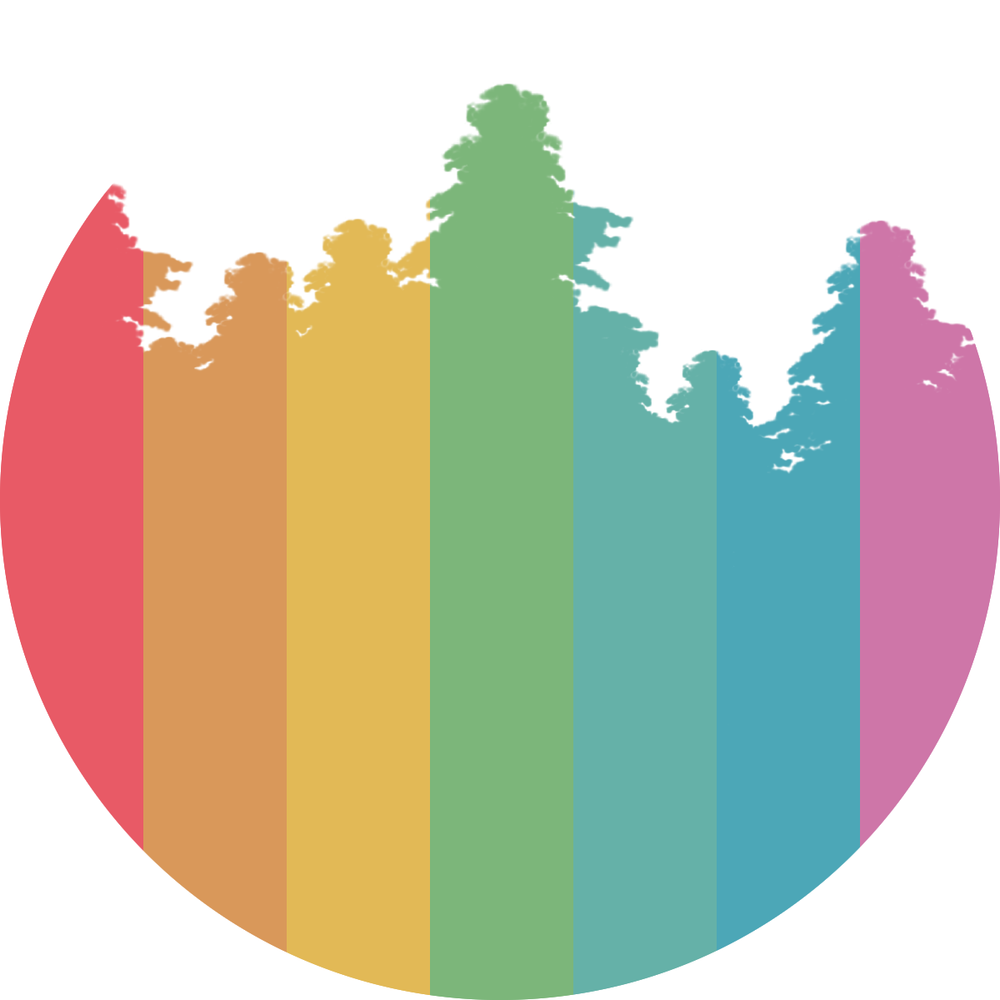
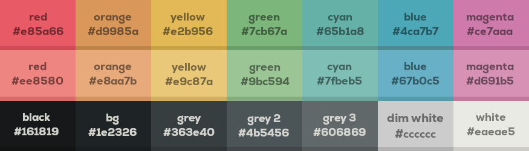
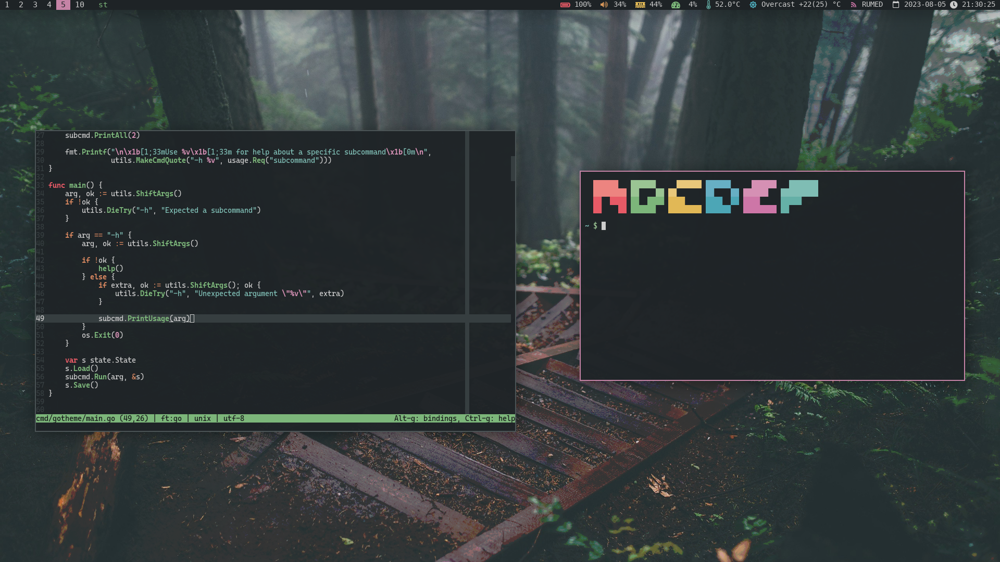

<h1>Forest Dew</h1>

A foggy forest-like 21-color colorscheme

	
	
	
	   

I like rain and cold, so i wanted a colorscheme that felt like that, but also was not too
unsaturated. So i came up with this.

## Table of contents
* [Palette](#palette)
* [Example of use](#example-of-use)
* [Inspirations](#inspiration)

## Palette

	 

| Name           | Hex     | Showcase |
| -------------- | ------- | -------- |
| Red            | #e85a66 |  |
| Orange         | #d9985a |  |
| Yellow         | #e2b956 |  |
| Green          | #7cb67a |  |
| Cyan           | #65b1a8 |  |
| Blue           | #4ca7b7 |  |
| Magenta        | #ce7aaa |  |
| Bright Red     | #ee8580 |  |
| Bright Orange  | #e8aa7b |  |
| Bright Yellow  | #e9c87a |  |
| Bright Green   | #9bc594 |  |
| Bright Cyan    | #7fbeb5 |  |
| Bright Blue    | #67b0c5 |  |
| Bright Magenta | #d691b5 |  |
| Black          | #161819 |  |
| Background     | #1e2326 |  |
| Grey 1         | #363e40 |  |
| Grey 2         | #4b5456 |  |
| Grey 3         | #606869 |  |
| Dim White      | #cccccc |  |
| White          | #eaeae5 |  |

## Example of use

	 

## Inspirations
- [everforest](https://github.com/sainnhe/everforest)
- [gruvbox](https://github.com/morhetz/gruvbox)
